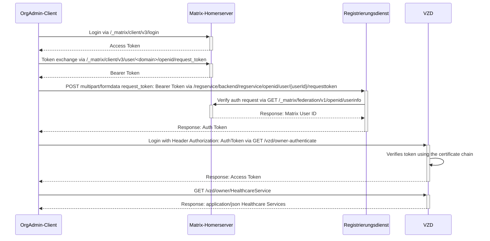
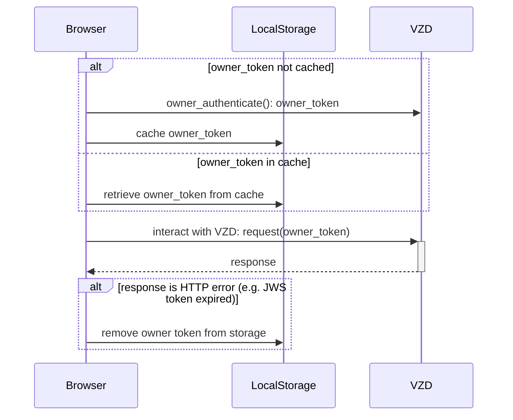

# VZD Auth
As an organization administrator I want to manage healthcare services.
An `owner_token`is required to interact with the VZD.

Only the _admin_ user who was automatically created during homeserver instance creation, can manage healthcare services in VZD.

## Quick access
Execute the getOwnerToken-test in the [get_owner_token.test.ts](src/data_providers/get_owner_token.test.ts)-file.
In the console you will receive a JavaScript command which you then just need to execute in your browser.

## Request an owner_token

## Cache the owner_token in the browser storage

